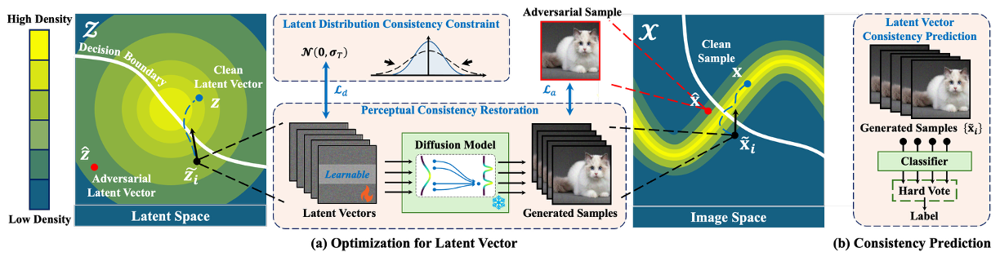

<h1 align="center">
     <br>Adversarial Purification by Consistency-aware Latent Space Optimization on Data Manifolds
<!-- <p align="center">
    <a href="https://openreview.net/forum?id=s4Jn6bKYGI">
        
    </a>
    <a href="https://arxiv.org/abs/2606.12900">
        
    </a>
</p> -->

<h4 align="center"></a>

>[Shuhai Zhang](https://scholar.google.com.hk/citations?user=oNhLYoEAAAAJ), Jiahao Yang, Hui Luo, Jie Chen, Li Wang, Feng Liu, Bo Han, Mingkui Tan
<!-- <sub>South China University of Technology, Pazhou Laboratory</sub> -->

<p align="center">
  
</p>

## ✨ Abstract

Deep neural networks (DNNs) are vulnerable to adversarial samples crafted by adding imperceptible perturbations to clean data, potentially leading to incorrect and dangerous predictions. Adversarial purification has been an effective means to improve DNNs robustness by removing these perturbations before feeding the data into the model. However, it faces significant challenges in preserving key structural and semantic information of data, as the imperceptible nature of adversarial perturbations makes it hard to avoid over-correcting, which can destroy important information and degrade model performance. In this paper, we break away from traditional adversarial purification methods by focusing on the clean data manifold. To this end, we reveal that samples generated by a well-trained generative model are close to clean ones but far from adversarial ones. Leveraging this insight, we propose Consistency Model-based Adversarial Purification (CMAP), which optimizes vectors within the latent space of a pre-trained consistency model to generate samples for restoring clean data. 
Specifically, 1) we propose a *Perceptual consistency restoration* mechanism by minimizing the discrepancy between generated samples and input samples in both pixel and perceptual spaces. 2) To maintain the optimized latent vectors within the valid data manifold, we introduce a *Latent distribution consistency constraint* strategy to align generated samples with the clean data distribution. 3) We also apply a *Latent vector consistency prediction* scheme via an ensemble approach to enhance prediction reliability. CMAP fundamentally addresses adversarial perturbations at their source, providing a robust purification. Extensive experiments on CIFAR-10 and ImageNet-100 show that our CMAP significantly enhances robustness against strong adversarial attacks while preserving high natural accuracy.

## ⚙️ Requirements

- **GPU:** NVIDIA RTX 3090 GPUs with 24 GB memory
- **CUDA:** 11.7
- **Python:** 3.8
- **PyTorch:** 1.13.1

## 💡 Virtual Environment

- **Conda Environment:** Create a conda environment and install all required dependencies for training and evaluation.
```bash
conda env create -f cmap.yml -n cmap
conda activate cmap
pip install git+https://github.com/RobustBench/robustbench.git@v1.0

cd flash-attention/
python setup.py install
```

- **MPI Environment:** A Message Passing Interface environment is required by consistency model on ImageNet.
```bash
wget https://www.mpich.org/static/downloads/4.1.2/mpich-4.1.2.tar.gz
tar -zxvf mpich-4.1.2.tar.gz
cd mpich-4.1.2
./configure  --prefix=/usr/local/mpich-4.1.2 # or your own path
make 
make install
```

## 📂 Data and Pre-trained Models

- **Dataset:** We conduct the experiments on two datasets: [CIFAR-10](https://www.tensorflow.org/datasets/catalog/cifar10) and [ImageNet-100](https://www.kaggle.com/datasets/ambityga/imagenet100). The former is automatically downloaded in the code, while the latter needs to be manually downloaded from the provided link.

- **Classifier:** We use pre-trained WideResNet of varying sizes for CIFAR-10 and ResNet for ImageNet-100. For ImageNet-100, we fine-tune the fully connected (FC) layer of classifiers to adapt predictions to 100-class subset.

- **Consistency Model:** We adopt the pre-trained model released by [Consistency Models](https://github.com/openai/consistency_models_cifar10) on CIFAR-10, with only a conversion from the JAX implementation to the PyTorch version. While on ImageNet-100, we train the consistency model using [consistency training](https://github.com/openai/consistency_models).

**Pre-trained Directory:** 
All the aforementioned models should be organized under ./pretrained. The complete set of corresponding checkpoints is provided in [pretrained](https://drive.google.com/file/d/1toj2a2JYZmgZf4BLrK_qvlfEXbbvc70W/view?usp=sharing).


## ▶️ Main Experiments 

The complete pipeline consists of two stages: adversarial example generation followed by sample purification. The workflow is provided through the following bash scripts.

### Purification against White-box Attacks:
We consider the commonly used $\ell_{\infty}$ and $\ell_{2}$ white-box attack methods, including PGD, AutoAttack and BPDA.

- CIFAR-10 ($32 \times 32$):
```bash
bash run_wb_purification_cifar.sh
```

- ImageNet-100 ($64 \times 64$):
```bash
bash run_wb_purification_imagenet.sh
```

### Purification against Adaptive Attacks:
We also design an attack specifically tailored to our defense mechanism to rigorously evaluate the robustness of our CMAP. 

- CIFAR-10 ($32 \times 32$):
```bash
bash run_ada_purification_cifar.sh
```

- ImageNet-100 ($64 \times 64$):
```bash
bash run_ada_purification_imagenet.sh
```

## 📖 Citation

If you find this work useful in your research, please consider citing:

```bibtex
@article{zhang2024adversarial,
  title={Adversarial Purification by Consistency-aware Latent Space Optimization on Data Manifolds},
  author={Zhang, Shuhai and Yang, Jiahao and Luo, Hui and Chen, Jie and Wang, Li and Liu, Feng and Han, Bo and Tan, Mingkui},
  journal={arXiv preprint arXiv:2412.08394},
  year={2024}
}
```